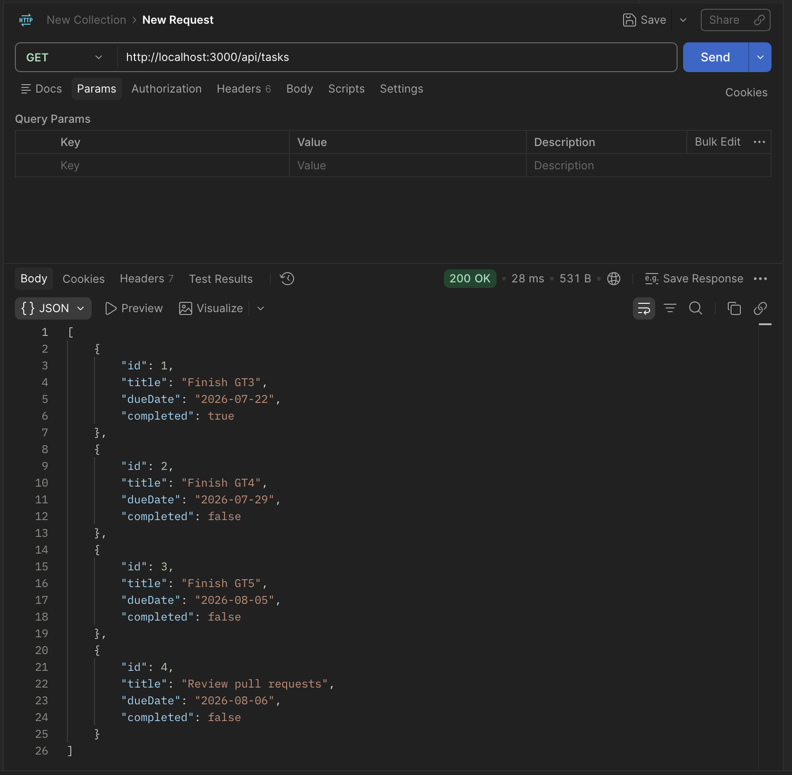
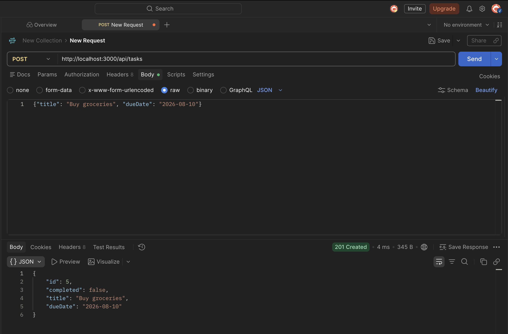
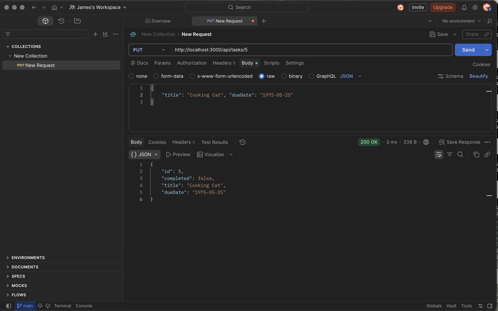
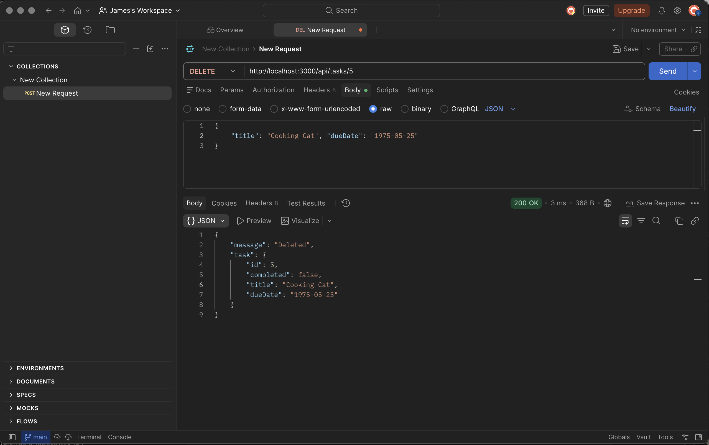
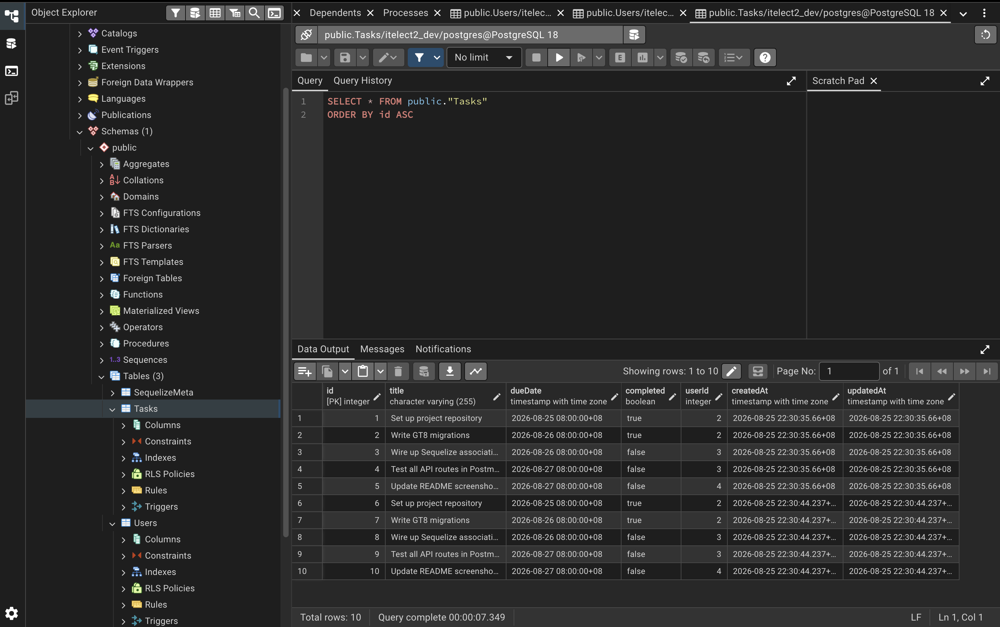
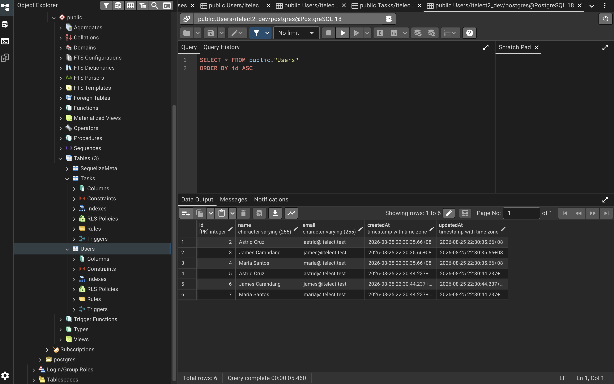

# First Activity
---

**Author**: James Israel Carandang

**Description**: GT1 in ITElect2
**Basic git commands**

git init
git add
git commit
git log
git branch
git push

# API TESTING

# GET

# POST

# PUT

# DELETE

# PG ADMIN TABLES
----
# Task Table

# User Table

